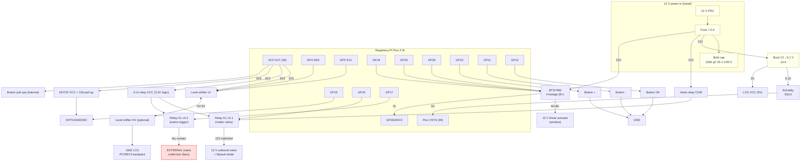

# Circuit Diagram — Greenhouse Controller

This is the schematic in two forms:

1. A **block schematic** (mermaid) for the mental model.
2. An authoritative **netlist** — the wire-by-wire connections the PCB layout consumes.

Everything is module-level: the Pico and each pre-made module is a block; the carrier
PCB just routes between their headers/terminals. Follows `PINOUT.md` exactly.

---

## 1. Block schematic

> Red = external mains outlet box (mains never enters this board).
> Yellow = 12 V power path.

---

## 2. Netlist (authoritative — PCB layout follows this)

Reference designators used on the carrier board:

| Ref | Part |
|-----|------|
| J1 | 12 V power in, 2-pos screw terminal (+ fuse upstream) |
| J2 | Valve out, 2-pos screw terminal (12 V switched) |
| J3 | Actuator out, 2-pos screw terminal (M+/M−) |
| J4 | Mains-trigger out, 2-pos screw terminal (dry contact to external box) |
| J5 | DHT22, 3-pos screw terminal (3V3 / DATA / GND) |
| U1 | Raspberry Pi Pico 2 W (2×20 female headers) |
| U2 | Buck converter module (4-pin header: IN+ IN− OUT+ OUT−) |
| U3 | BTS7960 H-bridge module (8-pin logic header + B+/B−/M+/M− terminals) |
| U4 | BSS138 I2C level shifter (LV/HV 4-pin each) — **optional**, see notes |
| K1 | **2-channel native-3.3 V relay module** (IN1=valve, IN2=mains trigger) |
| LCD1 | 1602 LCD + PCF8574 backpack (4-pin: GND VCC SDA SCL) |
| SW1..3 | Buttons − / OK / + |
| D1 | Schottky SS14 (buck 5V → VSYS) |
| D2 | Flyback 1N4007 across valve (if relay board lacks one) |
| C1 | 1000 µF/25 V/105 °C bulk on 12 V |
| C2 | 470 µF/25 V/105 °C bulk on 5 V |
| C3..6 | 100 nF decoupling (Pico 3V3, LCD, DHT, buck out) |
| R1 | 10 kΩ DHT data pull-up (3V3) |

### Power net: **12V**
- J1.+ → FUSE → node **12V**
- **12V** → C1.+ , U2.IN+ , U3.B+ , K1.CH1_COM
- (J2 valve gets 12V *through* K1 channel-1 contacts, not directly)

### Power net: **5V**
- U2.OUT+ → node **5V_BUCK**
- **5V_BUCK** → D1.anode ; D1.cathode → U1.VSYS(39) → node **5V** (post-diode is Pico side)
- **5V_BUCK** → C2.+ , LCD1.VCC , U4.HV
- (If the LCD backpack pull-ups reference 5 V, U4 is needed. If you power LCD1.VCC from 3V3
  instead, U4 can be omitted — see notes.)

### Power net: **3V3**
- U1.3V3OUT(36) → node **3V3**
- **3V3** → U4.LV , **K1.VCC** (2-ch relay logic) , R1.top , J5.pin1(DHT VCC) , C3..6

### Ground net: **GND** (star point at J1.−)
- J1.− → node **GND**
- **GND** → C1.− , C2.− , U1.GND(multiple) , U2.IN− , U2.OUT− , U3.B− , U3.GND ,
  U4.GND(both sides) , **K1.GND** , LCD1.GND , J5.pin3 , SW1.b , SW2.b , SW3.b ,
  D2.anode-side(valve −)

### Signal nets
| Net | From | To |
|-----|------|----|
| SDA_3V3 | U1.GP4(6) | U4.LV1 |
| SCL_3V3 | U1.GP5(7) | U4.LV2 |
| SDA_5V | U4.HV1 | LCD1.SDA |
| SCL_5V | U4.HV2 | LCD1.SCL |
| DHT_DATA | U1.GP15(20) | J5.pin2 , R1.bottom |
| RLY1_IN | U1.GP16(21) | K1.IN1 (valve) |
| RLY2_IN | U1.GP17(22) | K1.IN2 (mains trigger) |
| HB_RPWM | U1.GP18(24) | U3.RPWM |
| HB_LPWM | U1.GP19(25) | U3.LPWM |
| HB_EN | U1.GP20(26) | U3.R_EN + U3.L_EN (tied) |
| HB_IS | U3.R_IS + U3.L_IS | U1.GP26/ADC0(31) |
| BTN_PLUS | U1.GP10(14) | SW3.a |
| BTN_MINUS | U1.GP11(15) | SW1.a |
| BTN_OK | U1.GP12(16) | SW2.a |

> If you omit U4 (LCD run at 3.3 V), SDA_3V3/SCL_3V3 go straight to LCD1.SDA/SCL and the
> SDA_5V/SCL_5V nets disappear.

### Load-side (off-board) connections
| Net | From | To |
|-----|------|----|
| VALVE+ | K1.CH1_NO | J2.1 (→ valve +) |
| VALVE− | GND | J2.2 (→ valve −), with D2 flyback across J2 |
| ACT+ | U3.M+ | J3.1 (→ actuator) |
| ACT− | U3.M− | J3.2 (→ actuator) |
| TRIG | K1.CH2_NO / K1.CH2_COM | J4.1 / J4.2 (dry contact → external mains box input) |

---

## Design notes baked into the netlist

- **Star ground at J1.−**: all module grounds return to one point to avoid the actuator's
  several-amp pulses shifting the Pico's logic ground. On the milled board this is a single
  wide ground pour/bus near J1.
- **D1 (Schottky) isolates the buck from USB**: plug USB in to flash the Pico without the
  buck and USB fighting. VSYS accepts either source.
- **U4 level shifter is optional**: the PCF8574 backpack typically has 5 V pull-ups on
  SDA/SCL that would push the Pico's 3.3 V pins over spec — U4 (LV=3V3, HV=5V) fixes that.
  You can drop U4 if you run the LCD at 3.3 V or remove the backpack pull-ups (see PINOUT).
- **Relay module is native 3.3 V logic**: powered from 3V3, triggered directly by GP16/GP17.
  No JD-VCC jumper split or buffer transistors — that older workaround is retired. One
  2-channel board (K1) handles both the valve (ch.1) and the mains trigger (ch.2).
- **Mains stays external**: K2 only closes a **dry contact** (J4) that feeds the separate,
  properly-rated outlet box. No mains net exists on this board.
- **Flyback D2** across the valve if the relay board doesn't already include one across its
  switched output (most switch a dry contact, so the valve needs its own).
