# Connections — logical pin-to-pin (physical layout ignored)

Reflects the latest decisions: **two AHT21 sensors** (indoor + outdoor, each I2C 0x38
so they need separate buses), **LCD run at 3.3 V** (**no level shifter**), **Pico
socketed**, **3 buttons = direct toggles** (window / fans / mister), **12 V 5 A PSU**.

I2C addresses: AHT21 = **0x38** (fixed), PCF8574 LCD backpack = **0x27** (or 0x3F).
Indoor AHT21 shares I2C0 with the LCD; outdoor AHT21 gets its own bus, I2C1.

```mermaid
flowchart LR
  subgraph PSU["12V 5A PSU"]
    PSU_V["+12V"]
    PSU_G["GND"]
  end

  subgraph BUCK["Buck 12->5V (U2)"]
    B_IN["IN+"]
    B_ING["IN-"]
    B_OUT["OUT+ = 5V"]
    B_OUTG["OUT-"]
  end

  subgraph PICO["Pico 2 W (socketed)"]
    P_VSYS["VSYS p39"]
    P_3V3["3V3 OUT p36"]
    P_GND["GND p38"]
    P_SDA["GP4 SDA0 p6"]
    P_SCL["GP5 SCL0 p7"]
    P_SDA1["GP2 SDA1 p4"]
    P_SCL1["GP3 SCL1 p5"]
    P_R1["GP16 p21"]
    P_R2["GP17 p22"]
    P_RP["GP18 p24"]
    P_LP["GP19 p25"]
    P_EN["GP20 p26"]
    P_IS["GP26 ADC0 p31"]
    P_BW["GP10 p14"]
    P_BF["GP11 p15"]
    P_BM["GP12 p16"]
  end

  subgraph AHT["AHT21 indoor (I2C0 0x38)"]
    A_V["VIN 3V3"]
    A_G["GND"]
    A_SDA["SDA"]
    A_SCL["SCL"]
  end

  subgraph AHTO["AHT21 outdoor (I2C1 0x38)"]
    AO_V["VIN 3V3"]
    AO_G["GND"]
    AO_SDA["SDA"]
    AO_SCL["SCL"]
  end

  subgraph LCD["1602 LCD + PCF8574 (I2C0 0x27)"]
    L_V["VCC 3V3"]
    L_G["GND"]
    L_SDA["SDA"]
    L_SCL["SCL"]
  end

  subgraph RLY["2-ch relay 3.3V (K1)"]
    K_V["VCC 3V3"]
    K_G["GND"]
    K_1["IN1 valve"]
    K_2["IN2 mains"]
    K_C1["CH1 COM"]
    K_NO1["CH1 NO"]
    K_C2["CH2 COM"]
    K_NO2["CH2 NO"]
  end

  subgraph HB["BTS7960 H-bridge (U3)"]
    H_B["B+ 12V"]
    H_BG["B-"]
    H_VCC["VCC 3V3 logic"]
    H_G["GND"]
    H_RP["RPWM"]
    H_LP["LPWM"]
    H_EN["R_EN + L_EN"]
    H_IS["R_IS + L_IS"]
    H_MP["M+"]
    H_MG["M-"]
  end

  subgraph BTN["Buttons (screw terminals) - toggles"]
    BTN_W["window btn"]
    BTN_F["fans btn"]
    BTN_M["mister btn"]
    BTN_G["common GND"]
  end

  VALVE["12V valve"]
  ACT["window actuator"]
  MAINS["external mains box trigger IN"]

  %% ---- 12V rail ----
  PSU_V --> B_IN
  PSU_V --> H_B
  PSU_V --> K_C1
  PSU_G --> B_ING
  PSU_G --> H_BG

  %% ---- 5V rail ----
  B_OUT --> P_VSYS
  B_OUTG --> PSU_G

  %% ---- 3V3 rail ----
  P_3V3 --> A_V
  P_3V3 --> AO_V
  P_3V3 --> L_V
  P_3V3 --> K_V
  P_3V3 --> H_VCC

  %% ---- GND (common) ----
  P_GND --- PSU_G
  P_GND --- A_G
  P_GND --- AO_G
  P_GND --- L_G
  P_GND --- K_G
  P_GND --- H_G
  P_GND --- BTN_G

  %% ---- I2C0 bus (indoor sensor + LCD) ----
  P_SDA --- A_SDA
  P_SDA --- L_SDA
  P_SCL --- A_SCL
  P_SCL --- L_SCL

  %% ---- I2C1 bus (outdoor sensor, own bus) ----
  P_SDA1 --- AO_SDA
  P_SCL1 --- AO_SCL

  %% ---- relay logic ----
  P_R1 --> K_1
  P_R2 --> K_2

  %% ---- valve (12V switched by CH1) ----
  K_NO1 --> VALVE
  VALVE --> PSU_G

  %% ---- mains trigger (CH2 dry contact) ----
  K_C2 --> MAINS
  K_NO2 --> MAINS

  %% ---- H-bridge control ----
  P_RP --> H_RP
  P_LP --> H_LP
  P_EN --> H_EN
  H_IS --> P_IS
  H_MP --> ACT
  H_MG --> ACT

  %% ---- buttons (active-low to GND, internal pull-ups) ----
  P_BW --- BTN_W
  P_BF --- BTN_F
  P_BM --- BTN_M
```

## Same thing as a table (the authoritative list)

### Power
| From | To | Net |
|------|----|-----|
| PSU +12V | Buck IN+, BTS7960 B+, Relay CH1 COM | 12V |
| PSU GND | Buck IN−, BTS7960 B−, common GND | GND |
| Buck OUT+ (5V) | Pico VSYS (p39) | 5V |
| Pico 3V3 OUT (p36) | both AHT21 VIN, LCD VCC, Relay VCC, BTS7960 VCC | 3V3 |
| Pico GND (p38) | PSU GND + every module GND + button common | GND |

### Signals
| Pico pin | To | Purpose |
|----------|----|---------|
| GP4 SDA0 (p6) | indoor AHT21 SDA **and** LCD SDA | I2C0 data |
| GP5 SCL0 (p7) | indoor AHT21 SCL **and** LCD SCL | I2C0 clock |
| GP2 SDA1 (p4) | outdoor AHT21 SDA | I2C1 data (own bus) |
| GP3 SCL1 (p5) | outdoor AHT21 SCL | I2C1 clock |
| GP16 (p21) | Relay IN1 | mister valve on/off |
| GP17 (p22) | Relay IN2 | mains-box trigger (fans) |
| GP18 (p24) | BTS7960 RPWM | window open |
| GP19 (p25) | BTS7960 LPWM | window close |
| GP20 (p26) | BTS7960 R_EN + L_EN | H-bridge enable |
| GP26/ADC0 (p31) | BTS7960 R_IS + L_IS | current sense (optional stall detect) |
| GP10 (p14) | Window button → other side to GND | toggle window open/close (stop if moving) |
| GP11 (p15) | Fans button → other side to GND | toggle fans on/off |
| GP12 (p16) | Mister button → other side to GND | toggle mister on/off |

### Loads (off to the greenhouse)
| From | To |
|------|----|
| Relay CH1 NO | valve + ; valve − → GND |
| Relay CH2 COM/NO | external mains box trigger input (dry contact) |
| BTS7960 M+ / M− | window actuator leads |

Notes:
- Two I2C buses because the AHT21 address (0x38) is fixed: indoor on I2C0 (with LCD),
  outdoor on I2C1 (GP2/3, its own bus).
- GP15 (old DHT single-wire pin) is **free/spare** — e.g. a limit switch or status LED.
- Buttons use the Pico's internal pull-ups (`Pin.PULL_UP`), so each button is just
  GPIO ↔ button ↔ GND. No resistors needed. Single press = toggle.
- If the LCD backlight is too dim at 3.3 V, the fallback is: power LCD VCC from 5 V and
  add a BSS138 level shifter on the I2C0 SDA/SCL only. Keep both AHT21s on 3.3 V.
