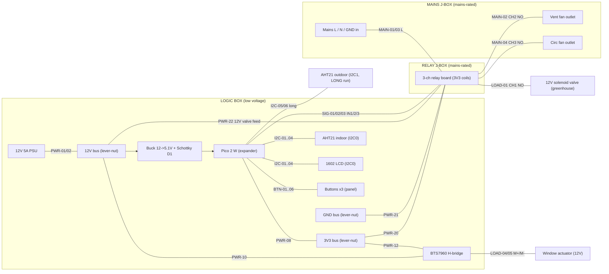

# Connections — module wiring & per-wire build checklist

The authoritative pin-to-pin list. Every wire has a **unique ID** (e.g. `PWR-06`,
`SIG-02`); the tables below are a build checklist — tick each wire as you land both ends.

Current design (post-SSR):
- **Three independent relays** — valve (GP16), **vent** fan (GP17), **circ** fan (GP21).
  The AC SSR is gone; these are **mechanical relays rated 10 A @ 125 V**.
- **Three stacked boxes.** A low-voltage **logic box** (Pico, buck, H-bridge, sensors,
  LCD, buttons); a **relay J-box** in the middle (the 3-ch relay board); a **mains J-box**
  (incoming mains + the two switched fan outlets). Both J-boxes are commercial mains-rated.
- **Only low-voltage crosses into the relay J-box:** the relay coil signals (3V3, GND,
  IN1/IN2/IN3) and the **12 V + valve feed** (the mister is a **12 V DC solenoid valve**,
  not a mains outlet). Mains stays between the relay J-box and the mains J-box.
- Two AHT21 sensors (indoor on I2C0 with the LCD; outdoor on I2C1 — separate bus, fixed
  0x38 address, **long >3 m run**). **LCD at 3.3 V → no level shifter.**

I2C addresses: AHT21 = **0x38** (fixed), PCF8574 LCD backpack = **0x27** (or 0x3F).

## Box / net topology

---

## Wire checklist

Pico pins are **GPxx (physical #)**. "Bus" = a lever-nut distribution node. Conductor is a
suggestion; anything equal-or-heavier is fine. ⚠️ MAIN-\* are **mains AC — to local code**.

### Power rails — logic box (Box A)

| ✅ | Wire | From (module · pin) | To (module · pin) | Conductor |
|----|------|---------------------|-------------------|-----------|
| ☐ | PWR-01 | PSU · +12V | 12V bus · in | 18 AWG |
| ☐ | PWR-02 | PSU · GND | GND bus · in | 18 AWG |
| ☐ | PWR-03 | 12V bus · out | Buck · IN+ | 20 AWG |
| ☐ | PWR-04 | GND bus · out | Buck · IN− | 20 AWG |
| ☐ | PWR-05 | Buck · OUT+ (5.1V) | Schottky D1 · anode | 20 AWG |
| ☐ | PWR-06 | Schottky D1 · cathode | Pico · VSYS (GP—, phys 39) | 20 AWG |
| ☐ | PWR-07 | Buck · OUT− | GND bus · out | 20 AWG |
| ☐ | PWR-08 | Pico · 3V3 OUT (phys 36) | 3V3 bus · in | 22 AWG |
| ☐ | PWR-09 | Pico · GND (phys 38) | GND bus · out | 22 AWG |
| ☐ | PWR-10 | 12V bus · out | BTS7960 · B+ | 18 AWG |
| ☐ | PWR-11 | GND bus · out | BTS7960 · B− | 18 AWG |
| ☐ | PWR-12 | 3V3 bus · out | BTS7960 · VCC (logic) | 24 AWG |
| ☐ | PWR-13 | GND bus · out | BTS7960 · GND | 24 AWG |
| ☐ | PWR-14 | 3V3 bus · out | AHT21 indoor · VIN | 24 AWG |
| ☐ | PWR-15 | GND bus · out | AHT21 indoor · GND | 24 AWG |
| ☐ | PWR-16 | 3V3 bus · out | LCD · VCC | 24 AWG |
| ☐ | PWR-17 | GND bus · out | LCD · GND | 24 AWG |

### Relay coil power + 12V valve feed — crosses Box A → Box B (low voltage)

| ✅ | Wire | From (module · pin) | To (module · pin) | Conductor |
|----|------|---------------------|-------------------|-----------|
| ☐ | PWR-20 | 3V3 bus · out | Relay board · VCC | 22 AWG |
| ☐ | PWR-21 | GND bus · out | Relay board · GND | 22 AWG |
| ☐ | PWR-22 | 12V bus · out | Relay · CH1 COM (valve feed) | 18–20 AWG |

### Logic signals — I2C (Box A)

| ✅ | Wire | From (module · pin) | To (module · pin) | Conductor |
|----|------|---------------------|-------------------|-----------|
| ☐ | I2C-01 | Pico · GP4 (phys 6) | AHT21 indoor · SDA | 24 AWG |
| ☐ | I2C-02 | Pico · GP4 (phys 6) | LCD · SDA | 24 AWG (shared node) |
| ☐ | I2C-03 | Pico · GP5 (phys 7) | AHT21 indoor · SCL | 24 AWG |
| ☐ | I2C-04 | Pico · GP5 (phys 7) | LCD · SCL | 24 AWG (shared node) |
| ☐ | I2C-05 | Pico · GP2 (phys 4) | AHT21 outdoor · SDA | Cat5e twisted pair (LONG) |
| ☐ | I2C-06 | Pico · GP3 (phys 5) | AHT21 outdoor · SCL | Cat5e twisted pair (LONG) |
| ☐ | I2C-07 | Pico · GP2 (SDA) | 3V3 bus (via 2.2 kΩ) | pull-up at Pico end |
| ☐ | I2C-08 | Pico · GP3 (SCL) | 3V3 bus (via 2.2 kΩ) | pull-up at Pico end |
| ☐ | PWR-18 | 3V3 bus · out | AHT21 outdoor · VIN | Cat5e pair (LONG) |
| ☐ | PWR-19 | GND bus · out | AHT21 outdoor · GND | Cat5e pair (LONG) |

> Outdoor I2C1 is capacitance-limited, not gauge-limited: Cat5e twisted pair, 2.2 kΩ
> pull-ups **at the Pico end**, firmware clocks it at 50 kHz. Keep it away from the 12V/motor
> run. See `docs/WIRING.md` for the full long-run rationale + P82B715 fallback.

### Logic signals — relay triggers, crosses Box A → Box B

| ✅ | Wire | From (module · pin) | To (module · pin) | Conductor |
|----|------|---------------------|-------------------|-----------|
| ☐ | SIG-01 | Pico · GP16 (phys 21) | Relay · IN1 (valve) | 24 AWG |
| ☐ | SIG-02 | Pico · GP17 (phys 22) | Relay · IN2 (vent fan) | 24 AWG |
| ☐ | SIG-03 | Pico · GP21 (phys 27) | Relay · IN3 (circ fan) | 24 AWG |

### Logic signals — H-bridge (Box A)

| ✅ | Wire | From (module · pin) | To (module · pin) | Conductor |
|----|------|---------------------|-------------------|-----------|
| ☐ | SIG-04 | Pico · GP18 (phys 24) | BTS7960 · RPWM | 24 AWG |
| ☐ | SIG-05 | Pico · GP19 (phys 25) | BTS7960 · LPWM | 24 AWG |
| ☐ | SIG-06 | Pico · GP20 (phys 26) | BTS7960 · R_EN + L_EN (tied) | 24 AWG |
| ☐ | SIG-07 | Pico · GP26/ADC0 (phys 31) | BTS7960 · R_IS + L_IS | 24 AWG (optional) |

### Buttons ×3 (Box A, panel — internal pull-ups, polarity-free)

| ✅ | Wire | From (module · pin) | To (module · pin) | Conductor |
|----|------|---------------------|-------------------|-----------|
| ☐ | BTN-01 | Pico · GP10 (phys 14) | Window button · leg A | 24 AWG |
| ☐ | BTN-02 | Window button · leg B | GND bus · out | 24 AWG |
| ☐ | BTN-03 | Pico · GP11 (phys 15) | Fans button · leg A | 24 AWG |
| ☐ | BTN-04 | Fans button · leg B | GND bus · out | 24 AWG |
| ☐ | BTN-05 | Pico · GP12 (phys 16) | Mister button · leg A | 24 AWG |
| ☐ | BTN-06 | Mister button · leg B | GND bus · out | 24 AWG |

### Low-voltage loads (to the greenhouse)

| ✅ | Wire | From (module · pin) | To (module · pin) | Conductor |
|----|------|---------------------|-------------------|-----------|
| ☐ | LOAD-01 | Relay · CH1 NO | Valve · + | 18–20 AWG (long run to manifold) |
| ☐ | LOAD-02 | Valve · − | GND bus · out | 18–20 AWG (long return) |
| ☐ | LOAD-03 | 1N4007 flyback across Valve +/− (band → +) | — | component |
| ☐ | LOAD-04 | BTS7960 · M+ | Window actuator · lead A | 18 AWG |
| ☐ | LOAD-05 | BTS7960 · M− | Window actuator · lead B | 18 AWG |

### ⚠️ Mains — relay J-box ↔ mains J-box (Box B ↔ Box C) — TO LOCAL CODE

Relay CH2/CH3 dry contacts switch the outlet hots. Neutral + ground go straight to the
outlets in the mains J-box. Use the box's/receptacle's rated conductor (typ. 14 AWG for a
15 A circuit); ground is green.

| ✅ | Wire | From (module · pin) | To (module · pin) | Conductor |
|----|------|---------------------|-------------------|-----------|
| ☐ | MAIN-01 | Mains in · L (hot) | Relay · CH2 COM (vent) | 14 AWG / to code |
| ☐ | MAIN-02 | Relay · CH2 NO | Vent outlet · hot | 14 AWG / to code |
| ☐ | MAIN-03 | Mains in · L (hot) | Relay · CH3 COM (circ) | 14 AWG / to code |
| ☐ | MAIN-04 | Relay · CH3 NO | Circ outlet · hot | 14 AWG / to code |
| ☐ | MAIN-05 | Mains in · N (neutral) | Vent outlet · neutral | 14 AWG / to code |
| ☐ | MAIN-06 | Mains in · N (neutral) | Circ outlet · neutral | 14 AWG / to code |
| ☐ | MAIN-07 | Mains in · GND | Both outlets · ground | 14 AWG green / to code |

> ⚠️ **Mains AC.** MAIN-\* live in the mains-rated J-boxes only. The relay board's coil side
> (VCC/GND/IN1-3, PWR-20/21 + SIG-01/02/03) is the only thing touching the low-voltage box.
> The 12 V valve feed (PWR-22, LOAD-01) is DC, not mains.

## Notes

- **GP15 (phys 20) is free/spare** — old DHT single-wire pin. Limit switch or status LED.
- Buttons cycle **per-actuator modes** now (not simple toggles): window `AUTO/OFF/OPN/CLS`,
  fans `AUTO/OFF/VNT/CIR/ALL`, mister `AUTO/OFF/ON/TIM`. See `docs/RULES.md`.
- LCD dim at 3.3 V fallback: power LCD VCC from 5 V + a BSS138 shifter on I2C0 SDA/SCL only;
  keep both AHT21s on the 3.3 V side.
</content>
</invoke>
